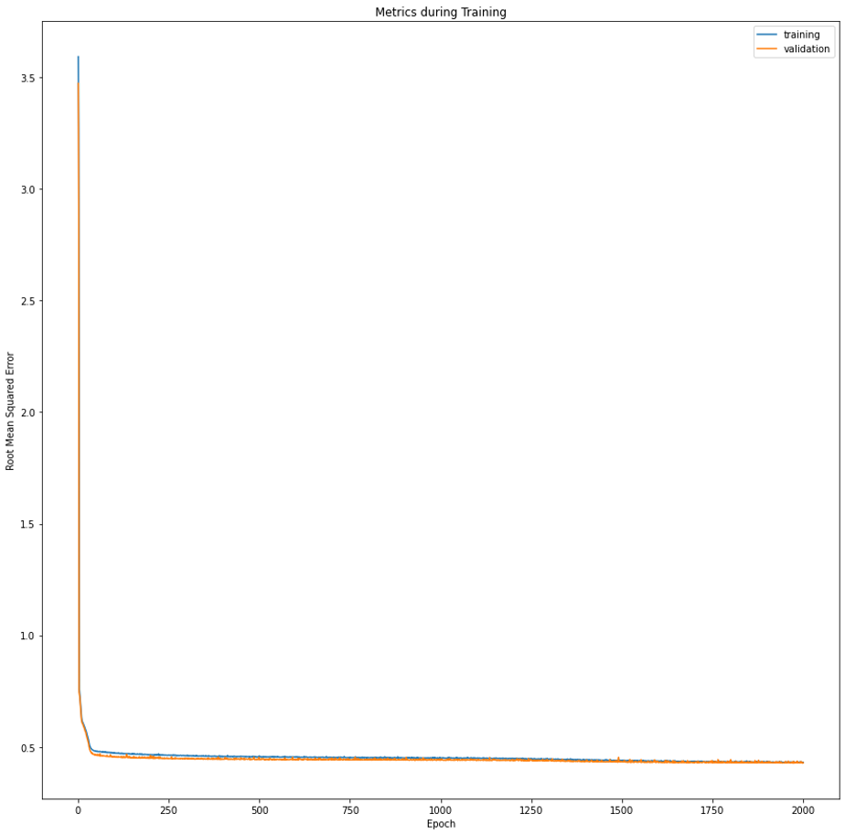
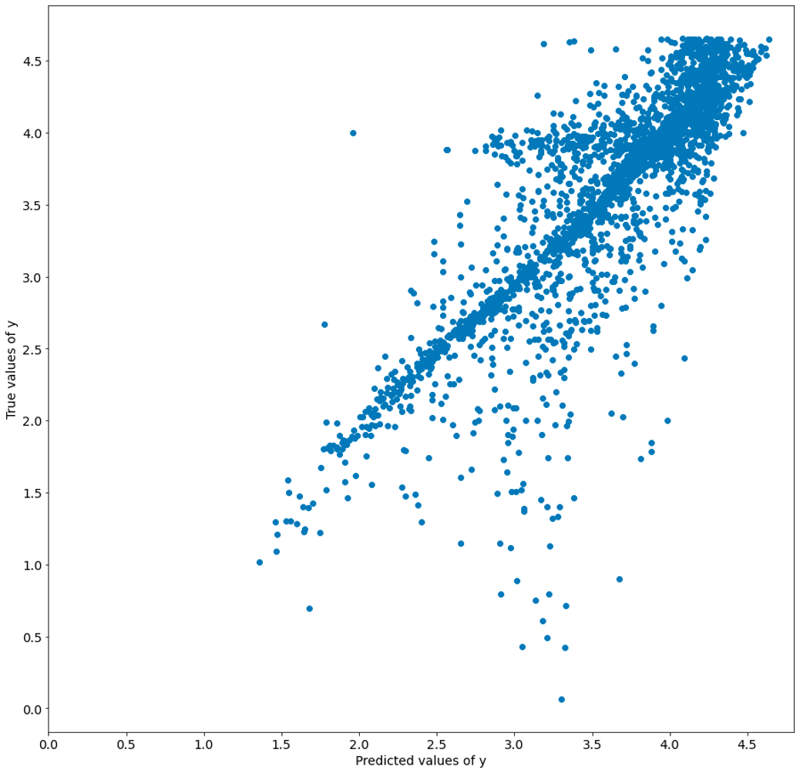
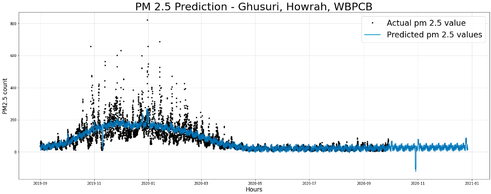
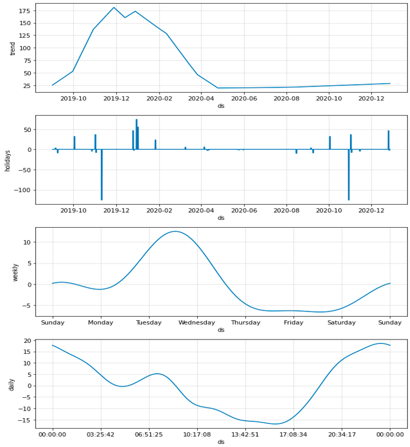
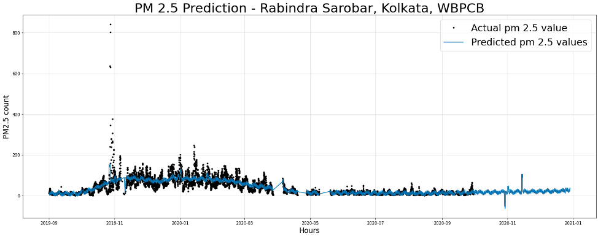
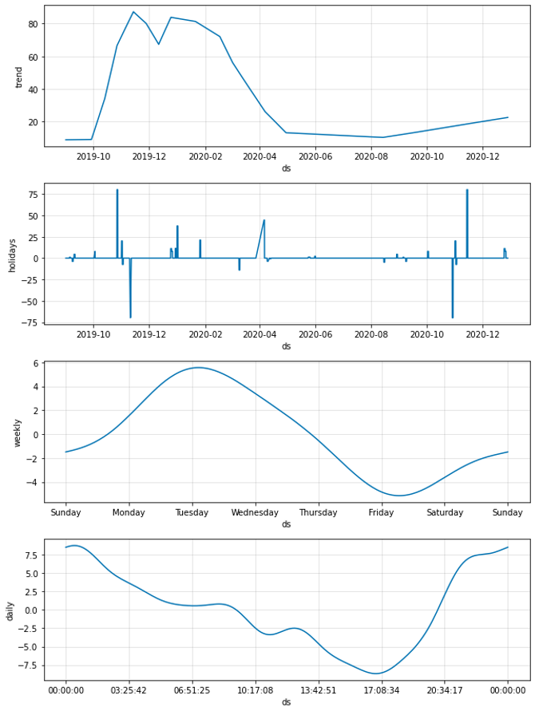

# Prediction of PM2.5(Air Pollutant) Level using Neural Networks

## Description

PM2.5 is an air pollutant responsible for multiple respiratory issues. The pollution levels in the city have increased over time. Pollution Levels Data from Pollution Control Board (PCB) sensors and Cleair network reference grade sensors from Enviome Research in Kolkata for one year have been used in this project with traffic vehicle counts at nearest locatins.

The data sources initially considered for building the neural network included latitude, longitude, PM2.5 level, temperature, humidity, rainfall and volumes of traffic at that location. Due to loss and damage of some sensors, some data points are missing. The weather dataset has missing data points and when added to the network, gave a very poor performance. Thus, the model has been trained on latitude, longitude, PM2.5 level, and volumes of traffic at that location.

A neural network for spatial interpolation was created using the above-mentioned data points. Since there are two kinds of devices, Pollution Control Board sensors were used as an input to the model. The interpolation was done on the Cleair device locations. After multiple experiments, the hyperparameters were fixed with Adam optimizer and a learning rate of 0.01 for regularization. Three activation layers with 8, 8 and 4 activation units gave the best performance. The metrics stored during training are root mean square error.

---
## Implementation details:

#### Tools and Language
* Python 3.7
* Jupyter notebook: 6.1.5
#### Frameworks:
* Tensorflow-keras: 2.3.1
* Pandas: 1.1.2
* Sklearn: 0.23.2
* FBProphet: 0.7.1
* Numpy: 1.18.5
* Matplotlib: 3.3.2

---
## Datapoints of the neural network:

| Column name                                  | Description                                                                                                     |
| -------------------------------------------- | --------------------------------------------------------------------------------------------------------------- |
| Datetime                                     | Timestamp at which PM2.5 value is recorded                                                                      |
| Ballygunge, Kolkata - WBPCB                  | PM2.5 levels recorded Ballygunge                                                                                |
| Belur Math, Howrah – WBPCB                   | PM2.5 levels recorded for Belur Math                                                                            |
| Bidhannagar, Kolkata – WBPCB                 | PM2.5 levels recorded for Bidhannagar                                                                           |
| Fort William, Kolkata – WBPCB                | PM2.5 levels recorded for Fort William                                                                          |
| Ghusuri, Howrah – WBPCB                      | PM2.5 levels recorded for Ghusuri                                                                               |
| Jadavpur, Kolkata – WBPCB                    | PM2.5 levels recorded for Jadavpur                                                                              |
| Padmapukur, Howrah – WBPCB                   | PM2.5 levels recorded for Padmapukur                                                                            |
| Rabindra Bharati University, Kolkata – WBPCB | PM2.5 levels recorded for Rabindra Bharati University                                                           |
| Rabindra Sarobar, Kolkata – WBPCB            | PM2.5 levels recorded for Rabindra Sarobar                                                                      |
| Victoria, Kolkata – WBPCB                    | PM2.5 levels recorded for Victoria                                                                              |
| US Diplomatic Post: Kolkata                  | PM2.5 levels recorded for US Diplomatic Post                                                                    |
| latitude                                     | latitude of the Cleair sensors that are being used to train the model                                           |
| longitude                                    | longitude of the Cleair sensors that are being used to train the model                                          |
| pm2.5_val                                    | PM2.5 value recorded at the Cleair sensor                                                                       |
| traffic_count                                | value of the number of vehicles passing through the traffic signal at the nearest location to the Cleair sensor |

---
## Results:

#### Spatial Interpolation:

Metrics from the sklearn library were used to evaluate the model. When tested on the test data, the model gives an R2 score of 0.69.

#### Time Series Model using FBProphet:

Location 1:  

Location 2:  

---
## Conclusion

From the plot it can be observed that,
* Daily: Pollution level is high during morning and late evenings.
* Weekly: Pollution is highest during the middle of the week.
* Yearly: Pollution levels have reduced significantly since Covid outbreak(March 2020).
* Pollution levels spiked in January.

These results give an insight into the pollution levels of the city. The findings from this project can be used by legislators and policy-makers to take necessary actions to curb the pollution levels.
